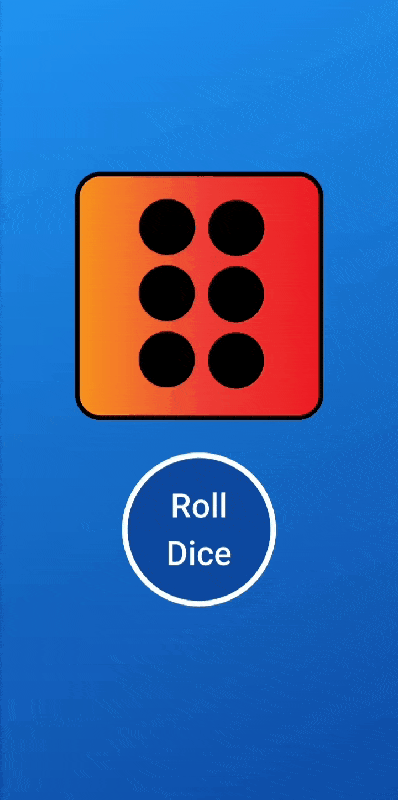

<h1>Roll the Dice</h1>

  This is a beginner-level Flutter application that demonstrates the basic usage of
  widgets, state management, and image rendering in Flutter.

<h2>Features</h2>
<ul>
  <li>Single screen interface</li>
  <li>Displays a dice image</li>
  <li>A "Roll" button to roll the dice</li>
  <li>Dice image changes randomly and stops at a number</li>
</ul>

<h2>App Preview</h2>

  

<h2>Getting Started</h2>

  To run this project locally:

<ol>
  <li>Clone the repository:</li>
  <pre><code>git clone https://github.com/Iftikhar-Shams-Niloy/flutter_roll_the_dice.git</code></pre>
  <li>Navigate to the project directory:</li>
  <pre><code>cd flutter_roll_the_dice</code></pre>
  <li>Get the dependencies:</li>
  <pre><code>flutter pub get</code></pre>
  <li>Run the application:</li>
  <pre><code>flutter run</code></pre>
</ol>

<h2>Requirements</h2>
<ul>
  <li>Flutter SDK installed</li>
  <li>Dart SDK installed</li>
  <li>An emulator or a physical device to run the app</li>
</ul>

<h2>Learning Outcome</h2>

  This project helps in understanding:

<ul>
  <li>How to use <code>StatefulWidget</code></li>
  <li>How to handle user interactions in Flutter</li>
  <li>How to display and update images dynamically</li>
</ul>
